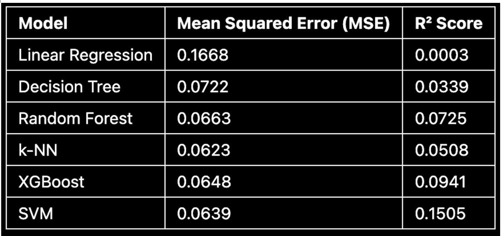
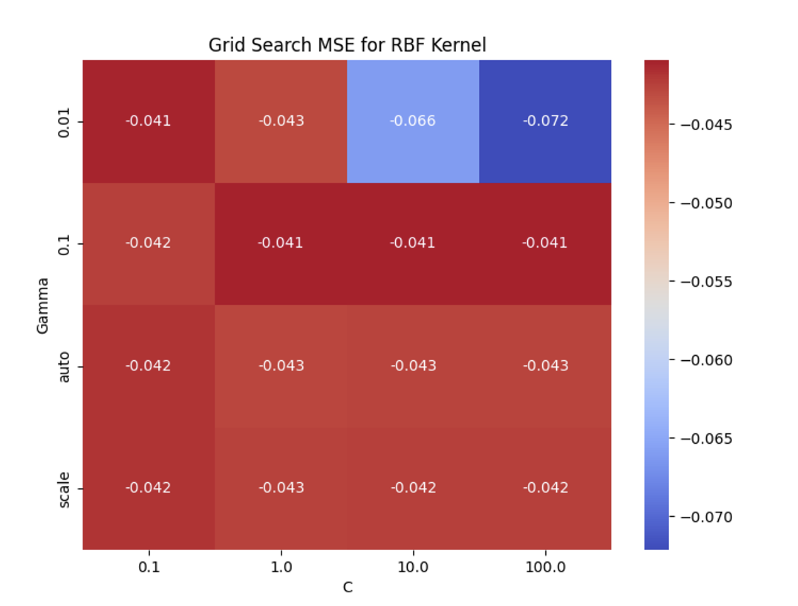
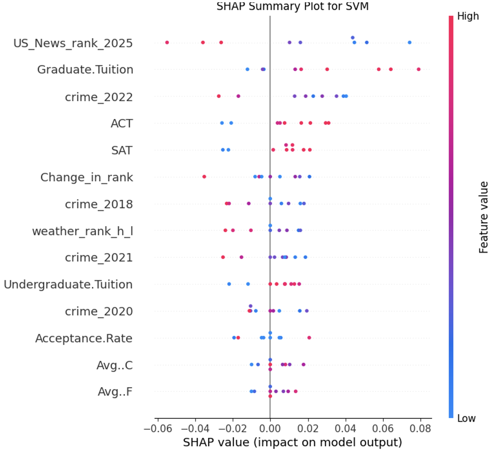
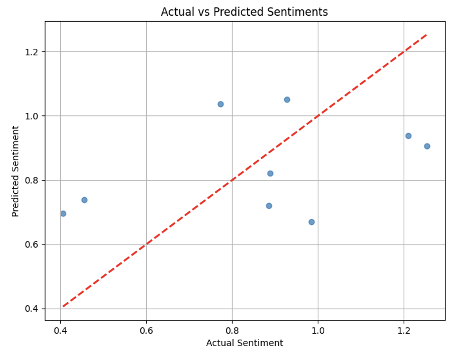

```{r setup, include=FALSE}
library(flexdashboard)
library(tidyverse)
library(tidytext)
library(wordcloud)
library(leaflet)
library(sf)
library(dplyr)
library(tigris)
library(shiny)
```

```{r}
reddit_all <- read.csv("../reddit_all.csv")
school_info <- read.csv("../full_school_info_cleaned.csv")
```

# Instructions

## Col1 {data-width=800}

<div style="font-size: 28px;margin-left: 20px;margin-top: 20px;">
<strong> Welcome to our <i> CampusLens: A clear view of campus life for students and policymakers</i> Dashboard! </strong> 
</div>

<div style="font-size: 18px;margin-left: 20px;">
This dashboard is designed to provide an interactive and user-friendly platform for college prospective students and university policymakers to explore and analyze data related to Reddit posts and traditional metrics from US News Top 50 Ranking US colleges. We aim to give prospective students a clearer picture of campus life and help policymakers make informed adjustments. Below, you'll find step-by-step instructions for using each page.
</div>

<div style="font-size: 18px;margin-left: 20px;">
**How to Use the Dashboard**
</div>

<div style="font-size: 16px;margin-left: 20px;">
1. **Home Page**: 
    - The home page provides an overview of the dashboard and the data sources used
    - You can find a table with school information and Reddit posts with sentiment scores

2. **Basic Info Comparison Page**:
    - Select two schools from the dropdown menu to compare their basic information side by side
    - The table will display the selected schools' attributes, such as standardized test scores etc
    - You can also view the location of the selected schools on the US map

3. **Sentiment Score Page**:
    - Choose a year and month from the dropdown menus to view the word cloud and sentiment score plots
    - The word cloud displays the most frequently used words in Reddit posts for the selected year and month
    - The top 5 and bottom 5 plots show the sentiment scores of the top and bottom 5 schools from Reddit posts for the selected year and month

4. **2024 School Sentiment Comparison Page**:
    - Select two universities from the dropdown menus to compare their sentiment scores for the year 2024
    - The line plot shows the average daily sentiment scores for the selected universities throughout the year

5. **Machine Learning Page**:
    - This page displays the results of machine learning models used to predict sentiment scores based on school attributes
    - Figure 1 shows the comparison of different models
    - Figure 2 displays the hyperparameter tuning results
    - Figure 3 shows the factor weights for SVM
    - Figure 4 presents the residual plot of sentiment prediction
</div>

<div style="font-size: 18px;margin-left: 20px;">
**Now Let's Start! Explore, Compare, and Make Informed Decisions with Ease. We hope you enjoy!**
</div>

## Col2 {data-width=50}

## Col3

<div style="display: flex; justify-content: space-between; align-items: center;">
  
  
</div>


# Home

## Column {data-width=350}

### **Intro of CampusLens**

Our platform is designed to assist prospective students in finding the university that best fits their aspirations and needs by providing detailed comparisons of school attributes, including academic performance, tuition, and student population. Additionally, this tool supports college policymakers by offering insights into student data, helping them craft policies and adjustments that address the real needs and priorities of students. Explore, compare, and make informed decisions with ease!

### **About the Data**
This dashboard uses data from [`reddit`](https://www.reddit.com/), [`US News`](https://www.usnews.com/), [`Current Results`](https://www.currentresults.com/Weather/US/average-annual-state-temperatures.php), [`FBI`](https://en.wikipedia.org/wiki/List_of_U.S._states_and_territories_by_violent_crime_rate) and [`National Center for Education Statistics`](https://nces.ed.gov/). The data includes most recent Reddit posts for top 50 US Universities. The data includes information on school attributes, such as SAT scores, ACT scores, acceptance rates, graduation rates, tuition fees, student populations, weather, and crime rates.

## Column {data-width=750}

### **School Information Table**
```{r school_info, message = FALSE, warning = FALSE}
DT::renderDataTable({
  DT::datatable(school_info,
                options = list(autoWidth = TRUE,
                               pageLength = 10,
                               scroller = TRUE,
                               scrollY = '500px'))
})
```

## Column {data-width=750}
### **Reddit Posts with Sentiment Scores**
```{r}

DT::renderDataTable({
  DT::datatable(reddit_all,
                options = list(autoWidth = TRUE,
                               pageLength = 10,
                               scroller = TRUE,
                               scrollY = '500px'))
})
```


# Basic Info Comparison

```{r include=FALSE}
school_info <- school_info %>%
  mutate(
    SAT = suppressWarnings(as.numeric(SAT)),
    ACT = suppressWarnings(as.numeric(ACT)),
    Acceptance.Rate = as.numeric(Acceptance.Rate),
    Graduation.Rate = as.numeric(Graduation.Rate),
    Undergraduate.Tuition = as.numeric(Undergraduate.Tuition),
    Graduate.Tuition = as.numeric(Graduate.Tuition),
    Student.Population = as.numeric(Student.Population)
  )

#School Class
School <- setRefClass(
  "School",
  fields = list(
    name = "character",
    city = "character",
    state = "character",
    SAT = "numeric",
    ACT = "numeric",
    acceptance_rate = "numeric",
    graduation_rate = "numeric",
    undergrad_tuition = "numeric",
    grad_tuition = "numeric",
    student_population = "numeric",
    crime_rate_avg = "numeric",
    avg_weather = "numeric",
    weather_rank_h_l = "integer"
  ),
  methods = list(
    #initialization function
    initialize = function(name, city, state, SAT, ACT, acceptance_rate, graduation_rate, undergrad_tuition, grad_tuition, student_population, avg_weather, weather_rank_h_l) {
      .self$name <- name
      .self$city <- city
      .self$state <- state
      .self$SAT <- SAT
      .self$ACT <- ACT
      .self$acceptance_rate <- acceptance_rate
      .self$graduation_rate <- graduation_rate
      .self$undergrad_tuition <- undergrad_tuition
      .self$grad_tuition <- grad_tuition
      .self$student_population <- student_population
      .self$avg_weather <- avg_weather
      .self$weather_rank_h_l <- weather_rank_h_l
      .self$crime_rate_avg <- NA_real_
    },
    
    #calculating average crime rate between 2018 to 2022
    calculate_crime_rate = function(crime_data) {
      avg_crime <- mean(crime_data, na.rm = TRUE)
      .self$crime_rate_avg <- avg_crime
    },
    
    #convert the object to a list
    to_list = function() {
      list(
        Name = .self$name,
        City = .self$city,
        State = .self$state,
        SAT = .self$SAT,
        ACT = .self$ACT,
        Acceptance_Rate = .self$acceptance_rate,
        Graduation_Rate = .self$graduation_rate,
        Undergraduate_Tuition = .self$undergrad_tuition,
        Graduate_Tuition = .self$grad_tuition,
        Student_Population = .self$student_population,
        Average_Weather_Fahrenheit = .self$avg_weather,
        Weather_Rank_High_to_Low = .self$weather_rank_h_l,
        Crime_Rate_Average = .self$crime_rate_avg
      )
    }
  )
)

# Create a list of School objects
schools <- map(1:nrow(school_info), ~ {
School$new(
  name = school_info$Institution[.x],
  city = school_info$City[.x],
  state = school_info$State_Postal[.x],
  SAT = school_info$SAT[.x],
  ACT = school_info$ACT[.x],
  acceptance_rate = school_info$Acceptance.Rate[.x],
  graduation_rate = school_info$Graduation.Rate[.x],
  undergrad_tuition = school_info$Undergraduate.Tuition[.x],
  grad_tuition = school_info$Graduate.Tuition[.x],
  student_population = school_info$Student.Population[.x],
  avg_weather = school_info$Avg..F[.x],
  weather_rank_h_l = school_info$weather_rank_h_l[.x]
)
})

#functional programming paradigm, using map2 to calcuate crime rate from school_info, columns are named crime_2018, crime_2019, ... , crime_2022
map2(schools, 1:nrow(school_info), ~ {
  crime_data <- unlist(school_info[.y, grep("^crime_", colnames(school_info))])
  .x$calculate_crime_rate(as.numeric(crime_data))
})

# Convert School objects to a named list for easier access
school_lookup <- setNames(schools, sapply(schools, function(s) s$name))
```


## Column {data-width=300}{.sidebar data-width=300}

### Compare School Metrics
```{r}
selectInput("school1", "Select School 1:", choices = names(school_lookup), selected = names(school_lookup)[1])
selectInput("school2", "Select School 2:", choices = names(school_lookup), selected = names(school_lookup)[7])
```

## Column {data-width=350}

### {data-height=650}
```{r}
renderTable({
  req(input$school1, input$school2)
  school_1 <- school_lookup[[input$school1]]$to_list()
  school_2 <- school_lookup[[input$school2]]$to_list()
  
  #create table
  tibble(
    Attribute = names(school_1),
    `School 1` = unlist(school_1)
  )
}, striped = TRUE, bordered = TRUE, hover = TRUE)
```

### School 1 Location{data-height=330}
```{r}
states <- tigris::states(cb = TRUE, resolution = "20m") %>%
  st_as_sf() %>%
  filter(!STUSPS %in% c("PR", "VI", "GU", "MP", "AS"))

renderLeaflet({
  # Filter the selected university from the input
  selected_state_code <- school_info %>%
    filter(Institution == input$school1) %>%
    pull(State_Postal)
  
  # Filter only contiguous US states
  contiguous_states <- states %>%
    filter(!STUSPS %in% c("AK", "HI", "PR", "VI", "GU", "MP", "AS"))
  
  # Check if a valid state is selected
  if (is.null(selected_state_code) || length(selected_state_code) == 0) {
    leaflet(contiguous_states) %>%
      addTiles() %>%
      addPopups(
        lng = -98.35, lat = 39.50, # Center of the contiguous US
        popup = "No data available for the selected university"
      ) %>%
      setView(lng = -98.35, lat = 39.50, zoom = 4) # Zoom to the US region
  } else {
    # Filter the specific state for highlighting
    selected_state <- contiguous_states %>%
      filter(STUSPS == selected_state_code)
    
    # Render the map
    leaflet(contiguous_states) %>%
      addTiles() %>%
      addPolygons(
        fillColor = "white",
        color = "black",
        weight = 1,
        fillOpacity = 0.5
      ) %>%
      addPolygons(
        data = selected_state,
        fillColor = "blue",
        color = "black",
        weight = 2,
        fillOpacity = 0.7
      ) %>%
      setView(lng = -98.35, lat = 39.50, zoom = 3) # Center and zoom on US
  }
})
```

Column {data-width=350}
-------------------------------------
### {data-height=650}
```{r}
renderTable({
  req(input$school1, input$school2)
  school_1 <- school_lookup[[input$school1]]$to_list()
  school_2 <- school_lookup[[input$school2]]$to_list()
  
  #create table
  tibble(
    Attribute = names(school_1),
    `School 2` = unlist(school_2)
  )
}, striped = TRUE, bordered = TRUE, hover = TRUE)
```

### School 2 Location {data-height=330}
```{r}
states <- tigris::states(cb = TRUE, resolution = "20m") %>%
  st_as_sf() %>%
  filter(!STUSPS %in% c("PR", "VI", "GU", "MP", "AS"))

renderLeaflet({
  # Filter the selected university from the input
  selected_state_code <- school_info %>%
    filter(Institution == input$school2) %>%
    pull(State_Postal)
  
  # Filter only contiguous US states
  contiguous_states <- states %>%
    filter(!STUSPS %in% c("AK", "HI", "PR", "VI", "GU", "MP", "AS"))
  
  # Check if a valid state is selected
  if (is.null(selected_state_code) || length(selected_state_code) == 0) {
    leaflet(contiguous_states) %>%
      addTiles() %>%
      addPopups(
        lng = -98.35, lat = 39.50, # Center of the contiguous US
        popup = "No data available for the selected university"
      ) %>%
      setView(lng = -98.35, lat = 39.50, zoom = 4) # Zoom to the US region
  } else {
    # Filter the specific state for highlighting
    selected_state <- contiguous_states %>%
      filter(STUSPS == selected_state_code)
    
    # Render the map
    leaflet(contiguous_states) %>%
      addTiles() %>%
      addPolygons(
        fillColor = "white",
        color = "black",
        weight = 1,
        fillOpacity = 0.5
      ) %>%
      addPolygons(
        data = selected_state,
        fillColor = "blue",
        color = "black",
        weight = 2,
        fillOpacity = 0.7
      ) %>%
      setView(lng = -98.35, lat = 39.50, zoom = 3.1) # Center and zoom on US
  }
})
```


# Sentiment Score

## Col1 { data-width=250}

### **Choose Year and Month: **

```{r}
selectInput(inputId = "selected_year", label = "Select Year:",
            choices = sort(unique(reddit_all$year)),
            selected = 2024)
selectInput(inputId = "selected_month", label = "Select Month:",
            choices = 1:12,
            selected = 5)
```

### **Wordcloud**

```{r}
words_to_exclude <- c("university", "student","school", "i'm", "students", "i’m", "https","hey","guys","im","i've","it's",
                      "i’ve","it’s","wondering","campus","people","taking")

school_names <- unique(reddit_all$school) %>% 
  tolower()

renderPlot({
  par(mar = c(1, 1, 1, 1))
  
   wordcloud_data <- reddit_all %>% 
      filter(year == input$selected_year, month == input$selected_month) %>%
      unnest_tokens(word, selftext) %>%
      anti_join(stop_words) %>%
      filter(!(word %in% words_to_exclude)) %>%
      filter(!str_detect(word, "^[0-9]+$")) %>%  
      filter(!(word %in% school_names)) %>%
      count(word, sort = TRUE) %>%
      top_n(40, n)
    
      if (nrow(wordcloud_data) == 0) {
        return(NULL)
      }
      
    wordcloud(
        words = wordcloud_data$word,
        freq = wordcloud_data$n,
        max.words = 30,
        random.order = FALSE,
        colors = brewer.pal(8, "Dark2")
    )
  })
```


## Col2 {data-width=650}

### **Top 5 Plot**

```{r}
renderPlot({
  
  top5_data <- reddit_all %>%
      filter(year == input$selected_year, month == input$selected_month) %>%
      group_by(Institution) %>%
      summarise(avg_monthly_score = sum(sentiment_score)/length(sentiment_score)) %>%
      arrange(desc(avg_monthly_score)) %>%
      head(5) # Top 5 schools
    
    if (nrow(top5_data) == 0) {
      plot.new()
      title("No data available for the selected year and month")
    return()
    }
    
    ggplot(top5_data, aes(y = reorder(Institution, avg_monthly_score), x = avg_monthly_score)) +
      geom_bar(stat = "identity", fill = "palegreen3") +
      labs(
        title = paste0("Top 5 Schools in ", input$selected_year,".", input$selected_month),
        y = NULL,
        x = "Sentiment Score") +
      theme_minimal()+
      xlim(-2, 2)
  })
```

### **Bottom 5 Plot**

```{r}
renderPlot({
      
    bottom5_data <- 
    reddit_all %>%
      filter(year == input$selected_year, month == input$selected_month) %>%
      group_by(Institution) %>%
      summarise(avg_monthly_score = sum(sentiment_score)/length(sentiment_score)) %>%
      arrange(avg_monthly_score) %>%
      head(5) 

      if (nrow(bottom5_data) == 0) {
        plot.new()
        title("No data available for the selected year and month")
      return()
      }
      
      ggplot(bottom5_data, aes(y = reorder(Institution, avg_monthly_score), x = avg_monthly_score)) +
        geom_bar(stat = "identity", fill = "orange") +
        labs(
          title = paste0("Bottom 5 Schools in ", input$selected_year,".", input$selected_month),
          y = NULL,
          x = "Sentiment Score") +
        theme_minimal()+
        xlim(-2, 2)
    })
```


# 2024 School Sentiment Comparison 

```{css}
body {
  margin-left: 20px; 
}
```

### {.row}

```{r}
selectInput("university1", "University 1:", 
            choices = sort(unique(reddit_all$Institution)), 
            selected = sort(unique(reddit_all$Institution))[14])
```

```{r}
renderPlot({
  
   university_sentiment <- reddit_all %>%
      filter(Institution == input$university1, year == 2024) %>%
      group_by(created_date) %>%
      summarise(sentiment_score = mean(sentiment_score)) %>%
      mutate(continuous = NA)
   
   university_sentiment$created_date <- as.Date(university_sentiment$created_date)
   
   month_ticks <- seq(as.Date("2024-01-01"), as.Date("2024-12-01"), by = "month")
   
   par(mar = c(10, 4, 4, 2))  # Increase the bottom margin (first value)
   
   plot(x = university_sentiment$created_date, 
        y = university_sentiment$sentiment_score, 
        xaxt = "n",
        type = "n",
        pch = 19,  
        cex = 0.8,   
        col = "darkgrey",
        xlab = "Date", 
        ylab = "Average Daily Sentiment Score",
        xlim = as.Date(c("2024-01-01", "2024-12-01")),
        ylim= c(-3,3), 
        main= paste(input$university1, "2024 Sentiment Score")
        )
    
    #### create an index to check whether the time point is continuous
    university_sentiment$continuous[1] <- TRUE
    
    for (i in 2:nrow(university_sentiment)) {
      university_sentiment$continuous[i] <- difftime(university_sentiment$created_date[i],
                                                      university_sentiment$created_date[i-1], units = "days") <= 1}

    start_of_line <-1 
    
        for (i in 2:nrow(university_sentiment)) {
          
          if (university_sentiment$continuous[i] != TRUE) {
            
            # stop at a discontinuous point, draw a line for the previous continuous points
            lines(university_sentiment$created_date[start_of_line:(i-1)],
                  university_sentiment$sentiment_score[start_of_line:(i-1)], 
                  type = "l", 
                  lwd = 1.5, 
                  col = "darkgreen", 
                  cex = 3.5, 
                  pch = 19)
            
            # draw a point at the discontinuous point 
            points(university_sentiment$created_date[i], university_sentiment$sentiment_score[i], 
                   col = "darkgrey", pch = 19, cex=0.7)
            
            # update the start of a new line
            start_of_line <- i
          }
          else {
            # draw a line between each consecutive points
            lines(university_sentiment$created_date[(i-1):i], university_sentiment$sentiment_score[(i-1):i], 
                  type = "l", lwd = 1.5, col = "darkgreen", cex = 0.7, pch = 19)
            start_of_line <- i 
          }
        }
        
        axis(1, at = month_ticks, labels = format(month_ticks, "%Y-%m") ,cex.axis = 1)
        
        abline(h = 0, col = "tan1", lwd = 2)

})
```


### {.row}

```{r}
selectInput("university2", "University 2:", 
            choices = sort(unique(reddit_all$Institution)), 
            selected = sort(unique(reddit_all$Institution))[13])
```

```{r}
renderPlot({
  
   university_sentiment <- reddit_all %>%
      filter(Institution == input$university2, year == 2024) %>%
      group_by(created_date) %>%
      summarise(sentiment_score = mean(sentiment_score)) %>%
      mutate(continuous = NA)
   
   university_sentiment$created_date <- as.Date(university_sentiment$created_date)
   
   month_ticks <- seq(as.Date("2024-01-01"), as.Date("2024-12-01"), by = "month")
   
   par(mar = c(10, 4, 4, 2))  # Increase the bottom margin (first value)
   
   plot(x = university_sentiment$created_date, 
        y = university_sentiment$sentiment_score, 
        xaxt = "n",
        type = "n",
        pch = 19,  
        cex = 0.8,   
        col = "darkgrey",
        xlab = "Date", 
        ylab = "Average Daily Sentiment Score",
        xlim = as.Date(c("2024-01-01", "2024-12-01")),
        ylim= c(-3,3), 
        main= paste(input$university2, "2024 Sentiment Score")
        )
    
    #### create an index to check whether the time point is continuous
    university_sentiment$continuous[1] <- TRUE
    
    for (i in 2:nrow(university_sentiment)) {
      university_sentiment$continuous[i] <- difftime(university_sentiment$created_date[i],
                                                      university_sentiment$created_date[i-1], units = "days") <= 1}

    start_of_line <-1 
    
        for (i in 2:nrow(university_sentiment)) {
          
          if (university_sentiment$continuous[i] != TRUE) {
            
            # stop at a discontinuous point, draw a line for the previous continuous points
            lines(university_sentiment$created_date[start_of_line:(i-1)],
                  university_sentiment$sentiment_score[start_of_line:(i-1)], 
                  type = "l", 
                  lwd = 1.5, 
                  col = "darkgreen", 
                  cex = 3.5, 
                  pch = 19)
            
            # draw a point at the discontinuous point 
            points(university_sentiment$created_date[i], university_sentiment$sentiment_score[i], 
                   col = "darkgrey", pch = 19, cex=0.7)
            
            # update the start of a new line
            start_of_line <- i
          }
          else {
            # draw a line between each consecutive points
            lines(university_sentiment$created_date[(i-1):i], university_sentiment$sentiment_score[(i-1):i], 
                  type = "l", lwd = 1.5, col = "darkgreen", cex = 0.7, pch = 19)
            start_of_line <- i 
          }
        }
        
        axis(1, at = month_ticks, labels = format(month_ticks, "%Y-%m") ,cex.axis = 1)
        
        abline(h = 0, col = "tan1", lwd = 2)

})
```


# Machine Learning

## Col 1 

### **Figure 1: Model Comparison** 

 {height=200px}

### **Figure 2: Hyperparameter Tuning**

{width=400px height=330px}

## Col 2

### **Figure 3: SVM Factor Weights**

 {width=300px}
 
### **Figure 4: Residual Plot of sentiment prediction**



## Col3 {data-width=200}

### **Conclusions** 

According to Figure 1, we attempted to use related factors such as weather, crime rate tuition, etc. to predict the sentiment scores. We used average sentiment scores based on reddit post generated by `syuzhet` package in R as output.  Multiple models were attempted for the prediction. The SVM gets the best prediction score of $R^2$ of 0.15, which is less than satisfactory.<br><br>

According to Figure 2, fine-tuning for SVM eventually selected c=100 and gamma of 0.01 as the best hyperparameters.<br><br>

According to Figure 3, Factors weights for SVM demonstrated that US_News ranking and graduate tuition, crime_rate are important in terms of average sentiment. This indicates that the USNews_ranking, although not taking into students sentiments in accounts but may have positive relationships with the student average sentiments.

